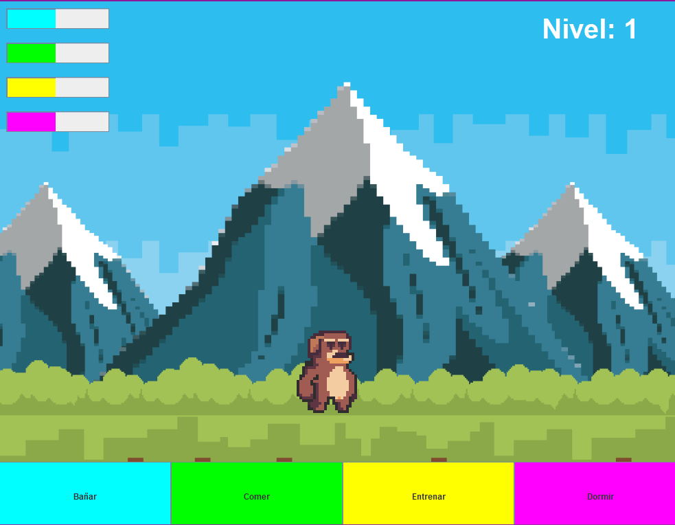
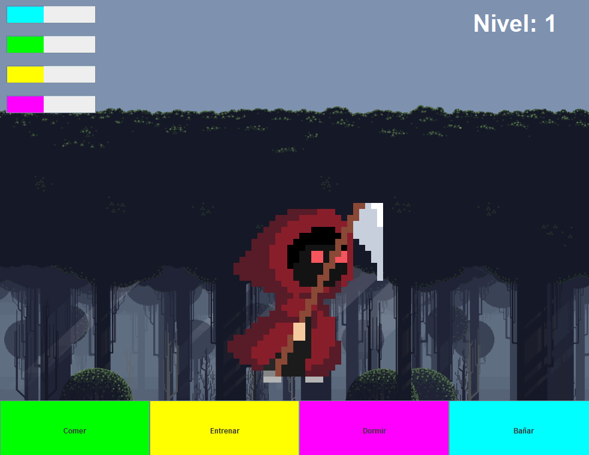

# Mascota virtual Tamagochi 🕹️

 # Descripción

Juego interactivo que permite a los usuarios cuidar de una mascota virtual. Los usuarios pueden controlar su movimiento, alimentar, bañar, entrenar y poner a dormir a su mascota mientras supervisan diferentes parámetros. La mascota subirá de nivel cuando sus necesidades se mantengan satisfechas.

|  |  |
|---------------------------------------------------|---------------------------------------------------|
| *Mascota #1*                    | *Mascota #2*                          |

## Características

- **Alimentar**: Alimenta a la mascota para reducir su nivel de hambre.
- **Bañar**: Baña a la mascota para reducir su nivel de suciedad.
- **Entrenar**: Entrena a la mascota para aumentar su felicidad.
- **Dormir**: Pon a dormir a la mascota para recuperar su energía.
- **Movimiento**: Controla el movimiento de la mascota usando las teclas `A` y `D` y el salto con `W`.
- **Subida de Nivel**: La mascota subirá de nivel cuando sus niveles de atención aumenten.
